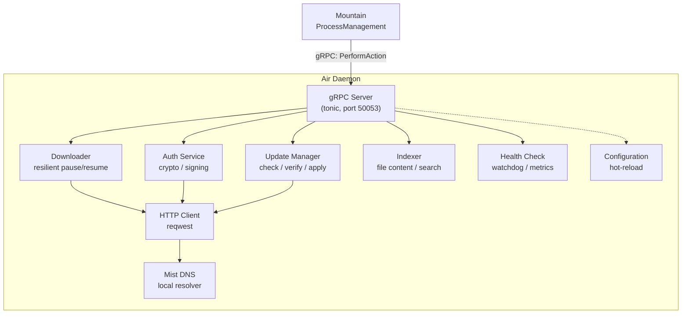

# Air: Background Daemon&#x2001;🪁

This document describes the `Air` background daemon:

- A persistent `Rust` sidecar process that runs alongside `Mountain`
- Handles resource-intensive operations to keep the main editor process
  responsive
- Operations include: update management, file indexing, cryptographic
  operations, and background downloads

The crate is declared in
[Cargo.toml](https://github.com/CodeEditorLand/Air/tree/Current/Cargo.toml) with
a library target named `AirLibrary` rooted at
[`Source/Library.rs`](https://github.com/CodeEditorLand/Air/tree/Current/Source/Library.rs)
and a single binary target named `Air` rooted at
[`Source/Binary.rs`](https://github.com/CodeEditorLand/Air/tree/Current/Source/Binary.rs).

---

## Table of Contents

1. [Overview](#overview)
2. [Architecture](#architecture)
3. [Module Map](#module-map)
4. [Services](#services)
5. [Data Flow](#data-flow)
6. [Startup Sequence](#startup-sequence)
7. [Configuration](#configuration)
8. [Related Documentation](#related-documentation)

---

---



> [!NOTE]
>
> The graph shows the request direction: every arrow starts at the gRPC server,
> so nothing inside the daemon runs without an inbound call or a timer.

## Overview&#x2001;📋

| Attribute    | Value                                                          |
| ------------ | -------------------------------------------------------------- |
| Language     | `Rust` (edition 2024)                                          |
| Crate type   | Binary                                                         |
| IPC          | `gRPC` (`tonic`) on port 50053                                 |
| Dependencies | `tokio`, `tonic`, `prost`, `reqwest`, `ring`, `Common`, `Mist` |
| Managed by   | `Mountain` `ProcessManagement`                                 |

Two further facts decide how the rest of this document is organised. Air is a
library plus a thin binary, and every subsystem is a directory of one-item
files rather than a single large module.

| Property         | Value                                                                    |
| ---------------- | ------------------------------------------------------------------------ |
| Library target   | `AirLibrary`, rooted at `Source/Library.rs`                              |
| Binary target    | `Air`, rooted at `Source/Binary.rs`                                      |
| Default features | `full-services` (`authentication`, `updates`, `downloader`, `indexing`)   |
| Client role      | Air is also a `gRPC` client of `Mountain` at `[::1]:50051`                |
| Server role      | Air hosts its own service at `[::1]:50053`                                |

---

## Architecture&#x2001;🏗️

`Air` is structured around a central `gRPC` server that receives task delegation
from `Mountain`. Internal modules handle distinct responsibilities.

```
                    +------------------------------------------+
                    |               Mountain                    |
                    |  ProcessManagement/AirManagement.rs       |
                    |  Sends work via PerformAction gRPC call   |
                    +-------------------+----------------------+
                                        |
                                        | gRPC (port 50053)
                                        v
+----------------------------------------------------------------+
|                        Air Daemon                               |
|                                                                 |
|  +------------------+  +------------------+  +----------------+ |
|  | gRPC Server      |  | Update Manager   |  | Downloader     | |
|  | (tonic)          |  | (check, verify,  |  | (resilient     | |
|  | routes tasks     |  |  apply patches)  |  |  pause/resume) | |
|  +------------------+  +------------------+  +----------------+ |
|                                                                 |
|  +------------------+  +------------------+  +----------------+ |
|  | Auth Service     |  | Indexer          |  | Health Check   | |
|  | (crypto, signing)|  | (file content    |  | (watchdog,     | |
|  |                  |  |  search index)   |  |  metrics)      | |
|  +------------------+  +------------------+  +----------------+ |
|                                                                 |
|  +------------------+  +------------------+  +----------------+ |
|  | HTTP Client      |  | Mist DNS         |  | Configuration | |
|  | (reqwest)        |  | (local resolver) |  | (hot-reload)   | |
|  +------------------+  +------------------+  +----------------+ |
+----------------------------------------------------------------+
```

> [!NOTE]
>
> The nine boxes are the runtime services; the module map below names the
> directory that implements each one.

### Runtime Composition&#x2001;🧩

The daemon is assembled in one direction. The binary owns the process, the
library owns the subsystems, and the server owns the request path.

| Layer     | Directory                       | Responsibility                                                     |
| --------- | ------------------------------- | ------------------------------------------------------------------ |
| Process   | `Source/Binary.rs`              | Owns `main`, the `Tokio` runtime, and the shutdown signal           |
| Library   | `Source/Library.rs`             | Declares every subsystem module and the shared `Utility` helpers    |
| Boot      | `Source/Initialize/`            | Turns configuration into running services                          |
| Transport | `Source/Vine/`                  | Hosts `AirService` and translates protobuf into subsystem calls     |
| State     | `Source/ApplicationState/`      | The single shared handle every service reads and writes             |
| Outbound  | `Source/Client/`, `Source/Mountain/` | Air's own client surfaces onto Air and onto `Mountain`         |

> [!IMPORTANT]
>
> Nothing in `Source/Library.rs` reaches back into `Source/Binary.rs`, which is
> what lets integration tests link `AirLibrary` without starting a daemon.

---

## Module Map&#x2001;🗺️

Every row below is a directory or file that exists in the tree. Paths link to
their canonical location on the `Current` branch.

| Path                      | Purpose                                                                        |
| ------------------------- | ------------------------------------------------------------------------------ |
| `Source/Binary.rs`        | Binary entry point; bootstraps `Tokio` runtime, starts daemon                  |
| `Source/Initialize/`      | Startup sequence: config loading, `gRPC` binding, state initialization         |
| `Source/Vine/`            | `gRPC` server implementation using `tonic`; routes incoming calls              |
| `Source/Updates/`         | Update lifecycle: check for updates, download, verify signature, apply patches |
| `Source/Downloader/`      | Resilient download manager with pause, resume, retry, and progress reporting   |
| `Source/Authentication/`  | Cryptographic signing of binaries, secure token storage                        |
| `Source/HTTP/Client.rs`   | HTTP client configured to use `Mist` local DNS resolver                        |
| `Source/HealthCheck/`     | Self-monitoring and watchdog for process health                                |
| `Source/Metrics/`         | Telemetry collection and reporting to `Mountain`                               |
| `Source/Logging/`         | Structured tracing output via the `tracing` crate                              |
| `Source/Indexing/`        | File content indexing for workspace search                                     |
| `Source/CLI/`             | Command-line argument parsing for daemon startup options                       |
| `Source/Resilience/`      | Retry logic and circuit breakers for network operations                        |
| `Source/Security/`        | Signature verification and secure storage utilities                            |
| `Source/Configuration/`   | Runtime configuration loading with hot-reload support                          |
| `Source/Library.rs`       | Library root exposing the public API for integration tests                     |
| `Source/Daemon/`          | Daemon lifecycle management (start, stop, restart)                             |
| `Source/ApplicationState/` | Shared daemon state: service status, connections, requests, resource usage    |
| `Source/Plugins/`         | Plugin discovery, loading, sandboxing, permissions and lifecycle hooks         |
| `Source/Client/`          | Client-side wrappers for callers that connect to Air's own `gRPC` server       |
| `Source/Mountain/`        | Outbound `gRPC` client Air uses to reach `Mountain` at `[::1]:50051`           |
| `Source/Tracing/`         | OpenTelemetry-compatible spans, sampling and propagation contexts              |
| `Source/DevLog.rs`        | Tag-filtered developer logging gated by the `Trace` environment variable       |

### Subsystem Directories&#x2001;📁

Each subsystem is a directory of single-purpose files. These are the
second-level units a reader will meet when opening the tree.

| Unit                              | Parent      | What it holds                                              |
| --------------------------------- | ----------- | ---------------------------------------------------------- |
| `Client/AirClient/`               | `Client`    | Low-level `gRPC` client and its per-message DTOs            |
| `Client/AirServiceProvider/`      | `Client`    | High-level facade adding request ids and error translation  |
| `Vine/Server/`                    | `Vine`      | `AirVinegRPCService`, the server-side `AirService` impl     |
| `Vine/Generated/`                 | `Vine`      | `prost` output for Air.proto, written by build.rs           |
| `Initialize/Configure/`           | `Initialize`| Logging setup and `gRPC` port selection                     |
| `Initialize/Build/`               | `Initialize`| Builds the configured `tonic` server                        |
| `Initialize/Service/`             | `Initialize`| Starts auth, download, health, index, update and state      |
| `Initialize/Command/`             | `Initialize`| Parses, validates and dispatches CLI commands               |
| `Indexing/Scan/`                  | `Indexing`  | Directory and file walking with exclude-pattern matching    |
| `Indexing/Process/`               | `Indexing`  | Encoding, MIME, language detection, tokenizing, symbols     |
| `Indexing/Language/`              | `Indexing`  | `Rust` and `TypeScript` parsers feeding symbol extraction   |
| `Indexing/State/`                 | `Indexing`  | Creates and mutates the in-memory `FileIndex`               |
| `Indexing/Store/`                 | `Indexing`  | Persists entries and answers search queries                 |
| `Indexing/Watch/`                 | `Indexing`  | Per-file watch registration for incremental reindexing      |
| `Indexing/Background/`            | `Indexing`  | Long-lived watcher task started at daemon boot              |

> [!NOTE]
>
> `Vine/Generated/` is build output, not hand-written code, and is regenerated
> whenever Proto/Air.proto changes.

### gRPC Service Definition (Vine/Air.proto)&#x2001;📜

```protobuf
service BackgroundServices {
    // Registration and lifecycle
    rpc Connect(ConnectRequest) returns (ConnectResponse);
    rpc Disconnect(DisconnectRequest) returns (DisconnectResponse);
    rpc Heartbeat(HeartbeatRequest) returns (HeartbeatResponse);

    // Task execution
    rpc PerformAction(ActionRequest) returns (ActionResponse);
    rpc CancelAction(CancelRequest) returns (CancelResponse);

    // Health
    rpc HealthCheck(HealthCheckRequest) returns (HealthCheckResponse);
    rpc GetStatus(StatusRequest) returns (StatusResponse);
}
```

> [!WARNING]
>
> The block above is the historical task-delegation sketch and is kept for
> continuity; the shipped contract differs and is described next.

The schema that actually compiles lives at
[Proto/Air.proto](https://github.com/CodeEditorLand/Air/tree/Current/Proto/Air.proto),
not under `Source/Vine/`. It declares one service, `AirService`, with sixteen
RPCs grouped by domain rather than the seven lifecycle calls sketched above.

| Domain         | RPCs                                                          |
| -------------- | ------------------------------------------------------------- |
| Authentication | `Authenticate`                                                 |
| Updates        | `CheckForUpdates`, `DownloadUpdate`, `ApplyUpdate`             |
| Downloads      | `DownloadFile`, `DownloadStream` (server-streaming)            |
| Indexing       | `IndexFiles`, `SearchFiles`, `GetFileInfo`                     |
| Monitoring     | `GetStatus`, `HealthCheck`, `GetMetrics`                       |
| Resources      | `GetResourceUsage`, `SetResourceLimits`                        |
| Configuration  | `GetConfiguration`, `UpdateConfiguration`                      |

`HealthCheck` and `GetStatus` are the two names common to both lists, which is
why heartbeat-style polling continues to work unchanged.

> [!IMPORTANT]
>
> [build.rs](https://github.com/CodeEditorLand/Air/tree/Current/build.rs)
> compiles the schema with `tonic_prost_build`, emitting both client and server
> stubs into `Source/Vine/Generated`.

---

## Services&#x2001;🔌

### Update Manager&#x2001;🔄

The update manager owns the full lifecycle of application updates:

| Phase    | Operation        | Description                                    |
| -------- | ---------------- | ---------------------------------------------- |
| Check    | `CheckForUpdate` | HTTP GET to update server for release manifest |
| Verify   | `VerifyChecksum` | SHA-256 verification of downloaded artifact    |
| Stage    | `StageUpdate`    | Cache update binary in staging directory       |
| Apply    | `ApplyUpdate`    | Replace running binary on next restart         |
| Rollback | `RollbackUpdate` | Restore previous version on failure            |

Implementation sits in
[`Source/Updates/`](https://github.com/CodeEditorLand/Air/tree/Current/Source/Updates),
where `UpdateManager.rs` drives the phases and `RollbackHistory.rs` plus
`RollbackState.rs` retain the previous version for the last row.

### Download Manager&#x2001;📥

The resilient download manager handles extension downloads, language server
binaries, and dependency fetching:

| Feature    | Implementation                                        |
| ---------- | ----------------------------------------------------- |
| Resume     | HTTP Range headers for partial download resume        |
| Retry      | Exponential backoff with configurable max attempts    |
| Progress   | Streaming progress reporting to `Mountain` via `gRPC` |
| Bandwidth  | Configurable rate limiting per download               |
| Concurrent | Parallel download queue with configurable concurrency |

Rate limiting is a separate file,
[`Source/Downloader/RateLimit.rs`](https://github.com/CodeEditorLand/Air/tree/Current/Source/Downloader/RateLimit.rs),
so the bandwidth row is enforced independently of the queue itself.

### Indexing Service&#x2001;🔍

File indexing builds and maintains a searchable content index of the workspace:

1. File system walker discovers files (respecting `.gitignore` and exclude
   patterns)
2. Language-aware content extraction (plain text, code tokens, symbols)
3. Incremental indexing on file system change events
4. Inverted index construction for fast text search
5. Index persistence across daemon restarts

Those five steps map onto six directories, one stage each:

| Stage         | Directory              | Representative function                       |
| ------------- | ---------------------- | --------------------------------------------- |
| Discover      | `Indexing/Scan/`       | `ScanDirectory`, `GetDefaultExcludePatterns`   |
| Extract       | `Indexing/Process/`    | `DetectLanguage`, `TokenizeContent`            |
| Parse         | `Indexing/Language/`   | `ParseRust`, `ParseTypeScript`                 |
| Mutate        | `Indexing/State/`      | `AddFileToIndex`, `UpdateContentIndex`         |
| Persist/query | `Indexing/Store/`      | `StoreEntry`, `QueryIndexSearch`               |
| Watch         | `Indexing/Watch/`      | `WatchFile`, driven by `Background/StartWatcher` |

> [!NOTE]
>
> `ScanDirectory` is `async` and has a parallel sibling,
> `ScanDirectoriesParallel`, for multi-root workspaces.

### Authentication Service&#x2001;🔐

Manages sensitive cryptographic operations:

- Binary signing for update authenticity verification
- Secure token storage for remote service authentication
- Login flow orchestration for cloud services
- Key generation and rotation for local encryption

The four bullets correspond to `CryptoKeys.rs`, `CredentialsStore.rs`,
`AuthSession.rs` and `AuthenticationService.rs` under
[`Source/Authentication/`](https://github.com/CodeEditorLand/Air/tree/Current/Source/Authentication).

### Application State&#x2001;🗃️

[`Source/ApplicationState/`](https://github.com/CodeEditorLand/Air/tree/Current/Source/ApplicationState)
is the shared handle threaded through every service. The gRPC server holds it,
each RPC reads or mutates it, and health reporting reads it back out.

| File                         | Holds                                                    |
| ---------------------------- | -------------------------------------------------------- |
| `ApplicationState.rs`        | The root `Struct` every service receives                  |
| `ServiceStatus.rs`           | `Starting`, `Running`, `Stopping`, `Stopped`, `Error`     |
| `ConnectionInfo.rs`          | Per-peer connection record                                |
| `ConnectionType.rs`          | Which caller class opened the connection                  |
| `ConnectionHealthReport.rs`  | Rolled-up connection health                               |
| `RequestState.rs`            | In-flight request bookkeeping                             |
| `RequestStatus.rs`           | Terminal status for a completed request                   |
| `PerformanceMetrics.rs`      | Latency and throughput counters                           |
| `ResourceUsage.rs`           | Process resource snapshot                                 |

> [!NOTE]
>
> `ServiceStatus::Error` carries a `String`, so a failed service reports why it
> failed rather than only that it did.

### Plugin System&#x2001;🧩

[`Source/Plugins/`](https://github.com/CodeEditorLand/Air/tree/Current/Source/Plugins)
extends the daemon with dynamically loaded plugins. The `Plugin` trait extends
`PluginHooks` and adds metadata, sandboxing, permissions, message handling and
capability checks.

| Concern      | Files                                                              |
| ------------ | ------------------------------------------------------------------ |
| Discovery    | `PluginDiscoveryResult.rs`, `PluginLoader.rs`                       |
| Registration | `PluginRegistry.rs`, `PluginManager.rs`                             |
| Description  | `PluginManifest.rs`, `PluginMetadata.rs`, `PluginInfo.rs`           |
| Lifecycle    | `PluginHooks.rs`, `PluginState.rs`                                  |
| Isolation    | `PluginSandboxConfig.rs`, `PluginSandboxManager.rs`                 |
| Authority    | `PluginPermission.rs`, `PluginCapability.rs`, `ApiVersion.rs`       |
| Messaging    | `EventBus.rs`, `PluginMessage.rs`                                   |
| Validation   | `PluginValidationResult.rs`, `PluginDependency.rs`                  |

Defaults are deliberately closed: `permissions` returns an empty vector,
`has_capability` returns `false`, and `Message` returns an error unless a plugin
opts in by overriding it.

> [!WARNING]
>
> A plugin that never overrides `has_permission` is denied everything - the
> trait's default answer is `false`.

### Client Layer&#x2001;📡

[`Source/Client/`](https://github.com/CodeEditorLand/Air/tree/Current/Source/Client)
is Air's client-side view of its own server, used by `Mountain`, external
scripts and integration tests. It is two layers, not one.

- **`AirClient`** - the low-level wrapper. Holds
  `Arc<Mutex<AirServiceClient<Channel>>>` so clones share a single channel, and
  exposes `DEFAULT_AIR_SERVER_ADDRESS`, the constant `"[::1]:50053"`.
- **`AirServiceProvider`** - the high-level facade. Generates a request id per
  call, translates failures into `AirError`, and collapses
  `update_available == false` into `Ok(None)` for `CheckForUpdates`.

Per-message DTOs live one per file beneath `AirClient/`: `AirMetrics`,
`AirStatus`, `FileInfo`, `ExtendedFileInfo`, `FileResult`, `IndexInfo`,
`ResourceUsage`, `UpdateInfo`, and `DownloadStreamChunk`.

> [!NOTE]
>
> Both layers are cheap to clone; the interior `tokio::sync::Mutex` serialises
> concurrent RPCs onto the one channel.

### Mountain Client&#x2001;⛰️

[`Source/Mountain/`](https://github.com/CodeEditorLand/Air/tree/Current/Source/Mountain)
reverses the direction: here Air is the client and `Mountain` is the server, so
Air can query status, check health and read configuration from the main
application.

| Setting            | Default                        | Source file              |
| ------------------ | ------------------------------ | ------------------------ |
| Address            | `[::1]:50051`                  | `Constants.rs`           |
| Connection timeout | `5` seconds                    | `Constants.rs`           |
| Request timeout    | `30` seconds                   | `Constants.rs`           |
| TLS / mTLS         | Enabled by the `mtls` feature  | `TlsConfig.rs`           |

### Boot Pipeline&#x2001;🔧

[`Source/Initialize/`](https://github.com/CodeEditorLand/Air/tree/Current/Source/Initialize)
turns configuration into running services, in four steps that match its four
subdirectories.

| Step         | Unit                    | Entry point                             |
| ------------ | ----------------------- | --------------------------------------- |
| Configure    | `Initialize/Configure/` | `ConfigureLog()`, `SelectPort(...)`     |
| Build        | `Initialize/Build/`     | `BuildServer`                           |
| Start        | `Initialize/Service/`   | `StartAuth`, `StartDownload`, `StartEcho`, `StartHealthCheck`, `StartIndex`, `StartUpdate`, `StartService` |
| Command      | `Initialize/Command/`   | `ParseArguments`, `ValidateCommand`, `HandleCommand`, `ConnectDaemon` |

`SelectPort` returns `Result<SocketAddr, String>` and is paired with
`ValidatePort`, so an unusable port fails before the server is built rather
than at bind time. `Initialize/Service/State/CreateState.rs` constructs the
`ApplicationState` the started services then share.

> [!NOTE]
>
> `StartEcho` exists alongside the real services as a minimal round-trip probe
> for verifying the transport in isolation.

### Observability&#x2001;📈

Four independent subsystems answer "what is the daemon doing", each with its
own directory.

| Subsystem   | Directory            | What it produces                                            |
| ----------- | -------------------- | ------------------------------------------------------------ |
| Logging     | `Source/Logging/`    | Structured JSON entries, rotation, sensitive-data filtering    |
| Metrics     | `Source/Metrics/`    | Prometheus-compatible counters and latency histograms          |
| Tracing     | `Source/Tracing/`    | OpenTelemetry-compatible spans, sampling, propagation          |
| HealthCheck | `Source/HealthCheck/`| Multi-level checks, degradation levels, recovery actions       |

`Logging/SensitiveDataFilter.rs` is the reason logs can be shipped: it strips
values described by `SensitiveDataConfig.rs` before an entry is written.
`HealthCheck/RecoveryAction.rs` and `RecoveryTrigger.rs` let a failing check
repair the daemon rather than only report on it.

### Developer Logging&#x2001;🔦

[`Source/DevLog.rs`](https://github.com/CodeEditorLand/Air/tree/Current/Source/DevLog.rs)
is separate from `Source/Logging/`. It is tag-filtered developer tracing gated
by the `Trace` environment variable, and the same tags work across `Mountain`,
`Air`, `Wind` and `Sky`. With `Trace` unset the daemon is silent.

| Value           | Effect                                                    |
| --------------- | ---------------------------------------------------------- |
| `Trace=all`     | Every tag                                                  |
| `Trace=short`   | Every tag, compressed and deduplicated                     |
| `Trace=grpc`    | One tag; combine with commas, as in `Trace=lifecycle,grpc` |
| unset           | Nothing - the daemon runs silent                           |

Available tags include `vfs`, `ipc`, `config`, `lifecycle`, `storage`,
`extensions`, `update`, `grpc`, `indexing`, `http`, `daemon`, `security`,
`metrics`, `air`, `resilience` and `bootstrap`.

> [!NOTE]
>
> In short mode consecutive duplicate messages collapse to a single line with an
> `(x14)`-style suffix and long app-data paths are aliased to `$APP`.

### Resilience and Security&#x2001;🛡️

[`Source/Resilience/`](https://github.com/CodeEditorLand/Air/tree/Current/Source/Resilience)
wraps every outbound call in four patterns: exponential backoff retry with
jitter (`Retry.rs`), circuit breaking for fault isolation
(`CircuitBreaker.rs`), the bulkhead pattern for resource isolation
(`BulkheadExecutor.rs`), and cascading deadlines (`Timeout.rs`).
`ResilienceOrchestrator.rs` composes them.

[`Source/Security/`](https://github.com/CodeEditorLand/Air/tree/Current/Source/Security)
covers the inbound side: token-bucket rate limiting per IP and per client
(`TokenBucket.rs`, `RateLimiter.rs`), checksum verification
(`ChecksumVerifier.rs`), encrypted credential storage (`SecureStorage.rs`),
and zeroizing memory for secrets (`SecureBytes.rs`). `SecurityAuditor.rs`
records each event as a typed `SecurityEvent` with a severity.

### Daemon and CLI&#x2001;🖥️

[`Source/Daemon/`](https://github.com/CodeEditorLand/Air/tree/Current/Source/Daemon)
owns process lifecycle: `DaemonManager.rs` starts, stops and restarts,
`DaemonStatus.rs` reports the current state, `ExitCode.rs` defines the exit
contract, and `Platform.rs` with `PlatformInfo.rs` isolate per-OS behaviour.

[`Source/CLI/`](https://github.com/CodeEditorLand/Air/tree/Current/Source/CLI)
is the operator interface onto a running daemon: `CliParser.rs` and
`CommandTypes.rs` read the invocation, `DaemonClient.rs` connects to it, and
`OutputFormat.rs` with `OutputFormatter.rs` render the reply.

---

## Data Flow&#x2001;📊

### Update Check Flow&#x2001;🔄

```
Mountain triggers update check
    |
    v
Air gRPC server receives CheckForUpdate
    |
    v
Update Manager sends HTTP GET to update server
    |
    +---> Server responds with release manifest
    |       (version, URL, checksum, signature)
    |
    v
Update Manager verifies response signature
    |
    v
Air returns update metadata to Mountain
    |
    v
Mountain displays update notification to user
```

> [!NOTE]
>
> The wire name for the first inbound step is `CheckForUpdates`, handled by
> `AirVinegRPCService::check_for_updates`.

### Download with Progress Flow&#x2001;📥

```
Mountain calls PerformAction(StartDownload { url, target })
    |
    v
Download Manager begins HTTP download with Range support
    |
    +---> Streaming progress events: bytesReceived, totalBytes, speed
    |        Mountain relays progress to Wind (UI progress bar)
    |
    +---> On complete: SHA-256 verification
    +---> On failure: retry with backoff (up to 3 attempts)
    +---> On all retries exhausted: return error to Mountain
    |
    v
Download Manager returns ActionResponse { success, filePath }
```

> [!NOTE]
>
> Streaming progress is carried by the `DownloadStream` RPC, whose frames arrive
> as `DownloadStreamChunk` values.

---

## Startup Sequence&#x2001;🚀

```
1. Mountain spawns Air binary via ProcessManagement
   - Sets environment: VINE_PORT, MIST_PORT, DATA_DIR, LOG_LEVEL
   - Watches process health via heartbeat

2. Air Binary::main() executes
   - Parses CLI arguments
   - Initializes tracing/logging
   - Loads Configuration (with hot-reload)

3. Air starts gRPC server on port 50053
   - Registers BackgroundServices service handlers
   - Begins listening for incoming connections

4. Air sends Connect request to Mountain
   - Registers available services: [updater, indexer, auth, downloader]
   - Exchanges version and capability information

5. Heartbeat monitoring begins
   - Both sides send Heartbeat every 5 seconds
   - Air includes resource usage metrics in heartbeat
   - Mountain detects timeout after 3 missed heartbeats

6. Air signals ready for task processing
   - Mountain begins dispatching background work
```

> [!IMPORTANT]
>
> Step 2 runs from `Source/Binary.rs`, and the handlers registered in step 3 are
> those of `AirService`, implemented by `AirVinegRPCService`.

---

## Configuration&#x2001;⚙️

`Air` reads configuration from environment variables and supports hot-reload via
file watching:

| Variable                   | Default            | Description                           |
| -------------------------- | ------------------ | ------------------------------------- |
| `VINE_PORT`                | `50053`            | `gRPC` server port                    |
| `MIST_PORT`                | `5380`             | `Mist` DNS server port                |
| `DATA_DIR`                 | `~/.land/data/air` | Data directory for caches and indexes |
| `LOG_LEVEL`                | `info`             | Tracing log level                     |
| `MAX_CONCURRENT_DOWNLOADS` | `3`                | Parallel download limit               |
| `UPDATE_CHECK_INTERVAL`    | `3600`             | Update check interval in seconds      |

> [!WARNING]
>
> The names above are the `Mountain`-side spawn contract; no file under
> `Source/` reads them directly.

What the daemon itself reads is prefixed. `ConfigurationManager.rs` sets
`EnvPrefix` to `AIR_` and resolves overrides against it, so the effective
variables are these:

| Variable                     | Read by                            |
| ---------------------------- | ---------------------------------- |
| `AIR_GRPC_BIND_ADDRESS`      | `Configuration/ConfigurationManager.rs` |
| `AIR_GRPC_MAX_CONNECTIONS`   | `Configuration/ConfigurationManager.rs` |
| `AIR_LOGGING_LEVEL`          | `Configuration/ConfigurationManager.rs` |
| `AIR_UPDATE_ENABLED`         | `Configuration/ConfigurationManager.rs` |
| `AIR_UPDATE_AUTO_DOWNLOAD`   | `Configuration/ConfigurationManager.rs` |
| `AIR_AUTH_ENABLED`           | `Configuration/ConfigurationManager.rs` |
| `AIR_AUTH_CREDENTIALS_PATH`  | `Configuration/ConfigurationManager.rs` |
| `AIR_LOG_JSON`, `AIR_LOG_FILE`, `AIR_LOG_DIR` | `Initialize/Configure/Log/ConfigureLog.rs` |
| `MOUNTAIN_ADDRESS` and the `MOUNTAIN_*` TLS set | `Mountain/MountainClientConfig.rs`, `Mountain/TlsConfig.rs` |
| `Trace`                      | `DevLog.rs`                        |

Hot-reload is implemented in `Configuration/HotReload.rs`, validation in
`Configuration/Schema.rs`, and the typed shape in
`Configuration/AirConfiguration.rs`. Backups are written to a `.ConfigBackups`
directory beside the configuration file whenever `EnableBackup` is set.

---

## Related Documentation&#x2001;📚

- [Common](https://github.com/CodeEditorLand/Common/tree/Current/Documentation/GitHub/Architecture.md) -
  Abstract core traits
- [Mountain](https://github.com/CodeEditorLand/Mountain/tree/Current/Documentation/GitHub/Architecture.md) -
  Main backend application
- [Mist](https://github.com/CodeEditorLand/Mist/tree/Current/Documentation/GitHub/Architecture.md) -
  DNS isolation server
- [InterComponentProtocol](https://github.com/CodeEditorLand/Land/tree/Current/Documentation/GitHub/InterComponentProtocol.md) -
  `gRPC` protocol specification
- [BuildPipeline](https://github.com/CodeEditorLand/Land/tree/Current/Documentation/GitHub/BuildPipeline.md) -
  Build pipeline

---

## Shim Compatibility

| 🟠 Low-Level Shim                              | 🔵 Coverage Shim                   |
| ---------------------------------------------- | ---------------------------------- |
| Tier: `TierShim=Own\|Preempt`                  | Tier: `TierShim=Proxy\|Replace`    |
| Engine prototype hooks                         | Service routing + audit            |
| Error, Emitter, Cancel, Dispose, Async, Timing | IPC SwallowMap, DI proxy, AuditLog |

> This Element supports the Land deep-shim interception system. The shim
> intercepts VS Code engine events at both the JavaScript prototype level (🟠
> orange) and the application service level (🔵 blue). Gated behind `TierShim`
> env var (default: `None` - zero overhead). See the
> [Shim documentation](https://github.com/CodeEditorLand/Land/tree/Current/Documentation/GitHub/Shim.md).

**Shim Modules:** No shim-specific modules - events routed through
`Wind`/`Mountain`/`Cocoon`.

---

**Project Maintainers:** Source Open
([Source/Open@Editor.Land](mailto:Source/Open@Editor.Land)) |
[GitHub Repository](https://github.com/CodeEditorLand/Air) |
[Report an Issue](https://github.com/CodeEditorLand/Air/issues)
