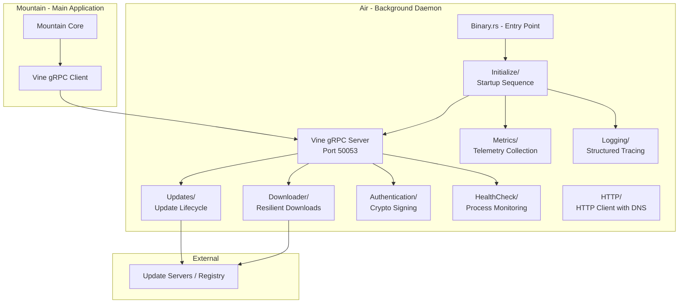
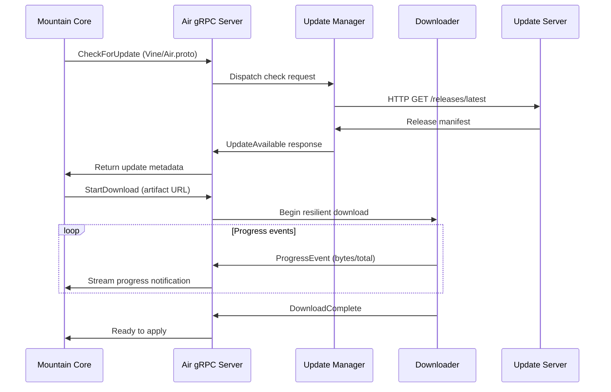

# Air - Deep Dive

This document provides the technical foundation for the Air background daemon
within the Land ecosystem. **Air** runs as a persistent sidecar process
alongside Mountain, offloading resource-intensive operations so the editor
remains responsive.

Everything below is checked against the crate's own
[`Source/`](https://github.com/CodeEditorLand/Air/tree/Current/Source) tree.
Where a module is named, it exists; where a behaviour is described, it is the
behaviour the code implements.

---

## Architecture

Air is a standalone Rust binary structured around a central gRPC server that
receives task delegation from Mountain. Internal modules handle distinct
responsibilities: updates, downloads, authentication, and health monitoring.

The diagram is the shape of the daemon at runtime, not the shape of the crate.
The sections that follow walk the crate itself, subsystem by subsystem.

---

## Process Model&#x2001;🪁

Air is one process with one Tokio runtime. The entry point does four things in
order: parse the command, configure logging, acquire the single-instance lock,
then build and serve. Nothing in the daemon assumes a second instance exists.

**[`Source/Binary.rs`](https://github.com/CodeEditorLand/Air/tree/Current/Source/Binary.rs)**

    async fn main() -> Result<(), Box<dyn std::error::Error + Send + Sync>> { Main().await }
    match tokio::time::timeout(Duration::from_secs(5), daemon_manager.AcquireLock()).await
    WaitForShutdownSignal().await;

The entry point bounds lock acquisition at five seconds, then parks on the
shutdown signal for the life of the daemon.

The supervision helpers that `Main` drives live one directory down, in
[Source/Binary/](https://github.com/CodeEditorLand/Air/tree/Current/Source/Binary):

- [Source/Binary/Monitor/StartMonitoring.rs](https://github.com/CodeEditorLand/Air/tree/Current/Source/Binary/Monitor/StartMonitoring.rs) - periodic resource and service sampling while the daemon runs.
- [Source/Binary/Shutdown/WaitForShutdownSignal.rs](https://github.com/CodeEditorLand/Air/tree/Current/Source/Binary/Shutdown/WaitForShutdownSignal.rs) - awaits the platform termination signal and releases the runtime.

### Startup Sequence&#x2001;🚀

[`Source/Initialize/`](https://github.com/CodeEditorLand/Air/tree/Current/Source/Initialize)
is the only place where startup order is decided. It is split by concern rather
than by phase, so each step is independently testable.

| Directory                                                                                                          | Responsibility                                                            |
| :----------------------------------------------------------------------------------------------------------------- | :------------------------------------------------------------------------ |
| [`Source/Initialize/Configure/`](https://github.com/CodeEditorLand/Air/tree/Current/Source/Initialize/Configure)     | Log setup (`Configure/Log`) and bind-address selection (`Configure/Port`) |
| [`Source/Initialize/Build/`](https://github.com/CodeEditorLand/Air/tree/Current/Source/Initialize/Build)             | Assembles the tonic server and its registered services                    |
| [`Source/Initialize/Service/`](https://github.com/CodeEditorLand/Air/tree/Current/Source/Initialize/Service)         | Starts each background service: Auth, Download, Echo, Health, Index, Update, Vine |
| [`Source/Initialize/Command/`](https://github.com/CodeEditorLand/Air/tree/Current/Source/Initialize/Command)         | Parses, validates and dispatches the CLI command, including `Command/Connect` |

**[`Source/Initialize/Configure/Port/SelectPort.rs`](https://github.com/CodeEditorLand/Air/tree/Current/Source/Initialize/Configure/Port/SelectPort.rs)**

    pub fn SelectPort(bind_address:Option<String>) -> Result<SocketAddr, String>
    pub fn ValidatePort(port:u16) -> Result<(), String>
    pub fn StartService(built: BuiltServer) -> StartedService

Port selection resolves the bind address before the server is built, which is
what keeps the 50053 and 50052 reservations from colliding.

> [!NOTE]
>
> `Configure`, `Build`, `Service` and `Command` are ordered by dependency, not
> by directory name: nothing can start before the port is chosen.

---

## Key Modules

Each row is a directory or file that exists at the root of
[`Source/`](https://github.com/CodeEditorLand/Air/tree/Current/Source).

| Path                     | Description                                                    |
| :----------------------- | :------------------------------------------------------------- |
| `Source/Binary.rs`       | Binary entry point; bootstraps Tokio runtime and starts daemon |
| `Source/Initialize/`     | Startup sequence: config loading, server binding, state init   |
| `Source/Vine/`           | gRPC server implementation using tonic; routes incoming calls  |
| `Source/Updates/`        | Update lifecycle: check, download, verify, apply patches       |
| `Source/Downloader/`     | Resilient download manager with pause, resume, and retry       |
| `Source/Authentication/` | Cryptographic signing of binaries and secure token storage     |
| `Source/HTTP/`           | HTTP client configured to use Mist local DNS resolver          |
| `Source/HealthCheck/`    | Self-monitoring and watchdog for process health                |
| `Source/Metrics/`        | Telemetry collection and reporting to Mountain                 |
| `Source/Logging/`        | Structured tracing output via the `tracing` crate              |
| `Source/CLI/`            | Command-line argument parsing for daemon startup options       |
| `Source/Resilience/`     | Retry logic and circuit breakers for network operations        |
| `Source/Security/`       | Signature verification and secure storage utilities            |
| `Source/Configuration/`  | Runtime configuration loading and hot-reload support           |
| `Source/Library.rs`      | Library root exposing the public API for integration tests     |
| `Source/ApplicationState/` | Shared daemon state: connections, service status, live metrics |
| `Source/Indexing/`       | File indexing, symbol extraction and search over the workspace |
| `Source/Plugins/`        | Plugin discovery, sandboxing and lifecycle management          |
| `Source/Daemon/`         | Single-instance PID lock and OS service installation           |
| `Source/Client/`         | Client-side gRPC wrappers for callers that connect to Air      |
| `Source/Mountain/`       | Outbound gRPC client Air uses to call back into Mountain       |
| `Source/Tracing/`        | OpenTelemetry-compatible spans, sampling and propagation       |
| `Source/DevLog.rs`       | Tag-filtered development logging shared across the Elements    |

---

## Core Subsystems&#x2001;🧱

### Shared Daemon State&#x2001;🧠

[`Source/ApplicationState/`](https://github.com/CodeEditorLand/Air/tree/Current/Source/ApplicationState)
holds everything the services need to agree on: who is connected, which service
is up, what each in-flight request is doing, and what the process is currently
consuming. It is one `Struct` behind async locks, constructed once from the
loaded configuration and shared by `Arc`.

**[`Source/ApplicationState/ApplicationState.rs`](https://github.com/CodeEditorLand/Air/tree/Current/Source/ApplicationState/ApplicationState.rs)**

    pub async fn RegisterConnection(&self, ...) -> Result<String>
    pub async fn UpdateServiceStatus(&self, Service:&str, Status:ServiceStatus) -> Result<()>
    pub async fn CleanupStaleConnections(&self, TimeoutSeconds:u64) -> Result<usize>

Connections are registered on arrival and reaped by timeout, so a Mountain that
dies without closing its channel does not leak a slot.

Supporting types in the same directory keep that state described rather than
implied: `ConnectionInfo`, `ConnectionType`, `ConnectionHealthReport`,
`ServiceStatus`, `RequestState`, `RequestStatus`, `PerformanceMetrics` and
`ResourceUsage`.

### File Indexing&#x2001;🔎

[`Source/Indexing/`](https://github.com/CodeEditorLand/Air/tree/Current/Source/Indexing)
is the largest subsystem and the clearest example of Air's reason to exist:
walking a workspace and extracting symbols is exactly the work that must not
happen on the editor's thread. `FileIndexer` is the facade; the pipeline behind
it is split one stage per directory.

- [`Source/Indexing/Scan/`](https://github.com/CodeEditorLand/Air/tree/Current/Source/Indexing/Scan) - recursive directory traversal and per-file admission, with default exclude patterns.
- [`Source/Indexing/Process/`](https://github.com/CodeEditorLand/Air/tree/Current/Source/Indexing/Process) - turns file content into symbols, grouped and sorted for consumers.
- [`Source/Indexing/Language/`](https://github.com/CodeEditorLand/Air/tree/Current/Source/Indexing/Language) - the per-language parsers, currently Rust and TypeScript.
- [`Source/Indexing/State/`](https://github.com/CodeEditorLand/Air/tree/Current/Source/Indexing/State) - constructs and mutates the in-memory `FileIndex`.
- [`Source/Indexing/Store/`](https://github.com/CodeEditorLand/Air/tree/Current/Source/Indexing/Store) - persists, reloads and queries the index across multiple search modes.
- [`Source/Indexing/Watch/`](https://github.com/CodeEditorLand/Air/tree/Current/Source/Indexing/Watch) - translates `notify` events into incremental index updates.
- [`Source/Indexing/Background/`](https://github.com/CodeEditorLand/Air/tree/Current/Source/Indexing/Background) - owns the watcher task and the debounce processor.

**[`Source/Indexing/Scan/ScanDirectory.rs`](https://github.com/CodeEditorLand/Air/tree/Current/Source/Indexing/Scan/ScanDirectory.rs)**

    pub async fn ScanDirectory(
    pub fn ExtractRustSymbols(content:&str, file_path:&PathBuf) -> Vec<SymbolInfo>
    pub async fn QueryIndexSearch(

One entry point per stage: scan discovers, the language parser extracts, the
store answers.

> [!NOTE]
>
> Watching is debounced rather than immediate - `StartDebounceProcessor` batches
> pending changes so a bulk checkout does not trigger one reindex per file.

### Plugin Runtime&#x2001;🧩

[`Source/Plugins/`](https://github.com/CodeEditorLand/Air/tree/Current/Source/Plugins)
lets the daemon be extended without rebuilding it. `PluginManager` discovers
manifests, validates metadata and permissions, checks version compatibility,
and then drives each plugin through load, start, stop and unload.

**[`Source/Plugins/PluginManager.rs`](https://github.com/CodeEditorLand/Air/tree/Current/Source/Plugins/PluginManager.rs)**

    pub async fn discover_plugins(&self, directory:&str) -> Result<Vec<String>>
    pub async fn load_from_manifest(&self, path:&str) -> Result<String>
    pub fn CheckAirVersionCompatibility(&self, metadata:&PluginMetadata) -> Result<()>

Discovery is separate from loading, so an incompatible plugin is rejected before
any of its code runs.

Sandboxing (`PluginSandboxManager`), permissions (`PluginPermission`),
capabilities (`PluginCapability`) and inter-plugin messaging (`EventBus`,
`PluginMessage`) are each their own file in that directory.

### Client Surface&#x2001;🔌

[`Source/Client/`](https://github.com/CodeEditorLand/Air/tree/Current/Source/Client)
is the other side of the wire, shipped inside Air so that Mountain, scripts and
integration tests all speak to the daemon through one maintained wrapper rather
than through raw generated stubs.

- [`Source/Client/AirClient/`](https://github.com/CodeEditorLand/Air/tree/Current/Source/Client/AirClient) - the low-level wrapper, one file per RPC, sharing a single tonic channel behind `Arc<Mutex<..>>`.
- [`Source/Client/AirServiceProvider/`](https://github.com/CodeEditorLand/Air/tree/Current/Source/Client/AirServiceProvider) - the high-level surface, adding request-id generation and structured error translation.

**[`Source/Client/AirClient/mod.rs`](https://github.com/CodeEditorLand/Air/tree/Current/Source/Client/AirClient/mod.rs)**

    pub const DEFAULT_AIR_SERVER_ADDRESS:&str = "[::1]:50053";
    pub async fn new(address:&str) -> Result<Self, AirError>
    pub fn FromClient(Client:Arc<AirClient>) -> Self

Both layers are cheap to clone; the interior mutex serialises concurrent calls
over the one channel.

### Vine Server&#x2001;🌿

[`Source/Vine/`](https://github.com/CodeEditorLand/Air/tree/Current/Source/Vine)
is Air's side of the bus. It hosts the service on `[::1]:50053` and wires the
shared `ApplicationState` into the generated traits.

- [`Source/Vine/Server/`](https://github.com/CodeEditorLand/Air/tree/Current/Source/Vine/Server) - `AirVinegRPCService`, the implementation of every RPC Air answers.
- [`Source/Vine/Generated/`](https://github.com/CodeEditorLand/Air/tree/Current/Source/Vine/Generated) - prost output for Air's protocol definition, re-exported as `Generated::air`.

**[`Source/Vine/Server/AirVinegRPCService.rs`](https://github.com/CodeEditorLand/Air/tree/Current/Source/Vine/Server/AirVinegRPCService.rs)**

    pub struct AirVinegRPCService {
    impl AirService for AirVinegRPCService {
    async fn calculate_file_checksum(path:&std::path::Path) -> Result<String>

The service struct is the single implementation point: every RPC in the
generated trait is answered here.

### Daemon Supervision&#x2001;🛡️

[`Source/Daemon/`](https://github.com/CodeEditorLand/Air/tree/Current/Source/Daemon)
owns single-instance behaviour and OS integration. `DaemonManager` holds a PID
file lock, reports status, and can generate and install a platform service unit.

**[`Source/Daemon/DaemonManager.rs`](https://github.com/CodeEditorLand/Air/tree/Current/Source/Daemon/DaemonManager.rs)**

    pub async fn AcquireLock(&self) -> Result<()>
    pub async fn IsAlreadyRunning(&self) -> Result<bool>
    pub async fn InstallService(&self) -> Result<()>

The lock is what makes a second Air exit rather than fight the first for the
port. `DaemonStatus`, `ExitCode`, `Platform` and `PlatformInfo` complete the
directory.

### Development Logging&#x2001;🪵

[`Source/DevLog.rs`](https://github.com/CodeEditorLand/Air/tree/Current/Source/DevLog.rs)
is a tag-filtered logger controlled by the `Trace` environment variable, using
the same tag vocabulary across Mountain, Air, Wind and Sky. With no `Trace` set,
the daemon is silent.

**[`Source/DevLog.rs`](https://github.com/CodeEditorLand/Air/tree/Current/Source/DevLog.rs)**

    Trace=lifecycle,grpc ./Air          # only lifecycle + gRPC
    Trace=indexing,http ./Air           # indexing + HTTP
    Trace=short ./Air                   # everything, compressed + deduped

Tags select subsystems; `short` keeps every tag but aliases long paths and
counts repeated lines.

> [!IMPORTANT]
>
> `DevLog` is development instrumentation and is independent of the structured
> `Logging` subsystem that writes the daemon's real log output.

### Supporting Subsystems&#x2001;⚙️

These are the modules the sections above lean on, each a directory at the root
of `Source/`.

| Module                                                                                                   | What it provides                                                      |
| :-------------------------------------------------------------------------------------------------------- | :--------------------------------------------------------------------- |
| [`Source/Resilience/`](https://github.com/CodeEditorLand/Air/tree/Current/Source/Resilience)               | Circuit breakers, retries, timeouts and bulkhead execution            |
| [`Source/Security/`](https://github.com/CodeEditorLand/Air/tree/Current/Source/Security)                   | Checksum verification, secure storage, rate limiting, audit events    |
| [`Source/Tracing/`](https://github.com/CodeEditorLand/Air/tree/Current/Source/Tracing)                     | Span generation, sampling and propagation contexts                    |
| [`Source/Metrics/`](https://github.com/CodeEditorLand/Air/tree/Current/Source/Metrics)                     | Counters for requests, downloads, indexing and resource use           |
| [`Source/HealthCheck/`](https://github.com/CodeEditorLand/Air/tree/Current/Source/HealthCheck)             | Per-service checks, degradation levels and recovery actions           |
| [`Source/Configuration/`](https://github.com/CodeEditorLand/Air/tree/Current/Source/Configuration)         | Schema, load, validate and hot-reload of `AirConfig`                  |
| [`Source/Mountain/`](https://github.com/CodeEditorLand/Air/tree/Current/Source/Mountain)                   | `MountainClient`, the outbound channel Air uses to call Mountain      |
| [`Source/CLI/`](https://github.com/CodeEditorLand/Air/tree/Current/Source/CLI)                             | Parser, handler, output formatting and the daemon client              |
| [`Source/Library.rs`](https://github.com/CodeEditorLand/Air/tree/Current/Source/Library.rs)                | Crate root re-exporting the modules above for integration tests       |

---

## Data Flow

The following sequence shows how Mountain delegates an update task to Air and
receives progress notifications.

**Port allocation:**

- Air listens on `[::1]:50053` (reserved for the Air daemon).
- Cocoon uses `[::1]:50052` (the VS Code extension host).

**[`Source/Downloader/DownloadManager.rs`](https://github.com/CodeEditorLand/Air/tree/Current/Source/Downloader/DownloadManager.rs)**

    pub async fn PauseDownload(&self, DownloadId:&str) -> Result<()>
    pub async fn ResumeDownload(&self, DownloadId:&str) -> Result<()>
    pub async fn CancelDownload(&self, DownloadId:&str) -> Result<()>

Pause, resume and cancel are addressed by download id, which is what lets a
transfer survive a dropped connection instead of restarting.

---

## Integration Points

| Connecting Element | Direction     | Mechanism                | Description                                                            |
| :----------------- | :------------ | :----------------------- | :--------------------------------------------------------------------- |
| **Mountain**       | Bidirectional | gRPC over Vine/Air.proto | Mountain delegates tasks; Air streams progress events back             |
| **Mist**           | Inbound       | Local DNS resolver       | Air configures its HTTP client to use Mist's DNS for secure resolution |
| **Vine**           | Inbound       | Protocol definition      | Air.proto defines service contracts; tonic generates Rust server stubs |

The Mist integration is not advisory.
[`Source/HTTP/Client.rs`](https://github.com/CodeEditorLand/Air/tree/Current/Source/HTTP/Client.rs)
re-exports
`Mist::Resolver::LandDnsResolver` and both the update and download paths build
their client against `Mist::dns_port()`, so `*.editor.land` resolution stays on
the local resolver.

---

## Configuration

| Parameter                | Source                          | Description                                    |
| :----------------------- | :------------------------------ | :--------------------------------------------- |
| Bind address             | CLI flag / environment          | Default `[::1]:50053`; overridable for testing |
| Update server URL        | Configuration file              | Base URL for checking and downloading updates  |
| Download cache directory | Configuration file              | Where partial downloads are stored for resume  |
| Health check interval    | Configuration file              | Frequency of self-monitoring checks            |
| Log level                | `AIR_LOG_LEVEL` environment variable | Tracing filter for structured log output  |

The configuration file is modelled by `AirConfig` in
[`Source/Configuration/AirConfiguration.rs`](https://github.com/CodeEditorLand/Air/tree/Current/Source/Configuration/AirConfiguration.rs),
which groups settings under `gRPC`, `Authentication`, `Updates`, `Downloader`,
`Indexing`, `Logging` and `Performance`.

> [!NOTE]
>
> Air's own logging reads `AIR_LOG_LEVEL`, `AIR_LOG_JSON` and `AIR_LOG_FILE`.
> `RUST_LOG` is set to `info` only inside the service units that `DaemonManager`
> generates, so a `RUST_LOG` value in your shell does not change a running
> daemon's verbosity.

Air is spawned automatically by Mountain at startup, from
[Mountain/Source/Binary/Service/AirStart.rs](https://github.com/CodeEditorLand/Mountain/tree/Current/Source/Binary/Service/AirStart.rs),
gated on the `AirIntegration`
build feature and the `Spawn` environment variable. Mountain does not probe for
an existing daemon; a second Air detects the first through its own PID lock and
exits.

> [!WARNING]
>
> Mountain degrades gracefully when Air is unavailable - the workbench still
> runs, without update, index or system-monitor capability.
