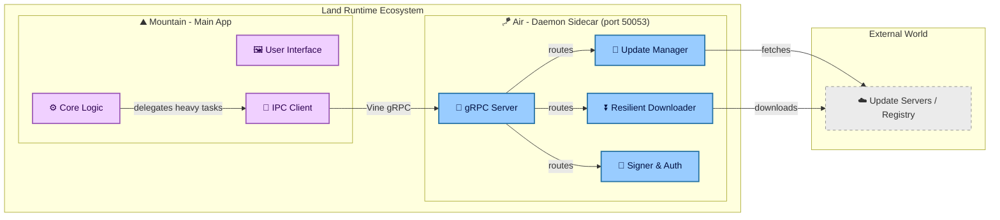

<table>
	<tr>
		<td align="left" valign="middle">
			<h3 align="left">Air&#x2001;🪁</h3>
		</td>
		<td align="left" valign="middle">
			<h3 align="left">&#x2001;+&#x2001;</h3>
		</td>
		<td align="left" valign="middle">
			<h3 align="left">
				<a href="https://Editor.Land" target="_blank">
					<picture>
						<source media="(prefers-color-scheme: dark)" srcset="https://PlayForm.Cloud/Dark/Image/GitHub/Land.svg">
						<source media="(prefers-color-scheme: light)" srcset="https://PlayForm.Cloud/Image/GitHub/Land.svg">
						
					</picture>
				</a>
			</h3>
		</td>
		<td align="left" valign="middle">
			<h3 align="left">
				<a href="https://Editor.Land" target="_blank">Land&#x2001;🏞️</a>
			</h3>
		</td>
	</tr>
</table>

---

# **Air**&#x2001;🪁

The Native Background Daemon for `Land`&#x2001;🏞️.

> **`VS Code` cold-starts slowly because everything initializes fresh each
> launch. Updates require a full restart that kills open terminals and
> in-progress work. There is no mechanism to pre-stage work between sessions.**

_"The next version is already downloaded and verified before you decide to
update. The main window never blocks waiting for a download."_

[](https://github.com/CodeEditorLand/Air/tree/Current/LICENSE)
[](https://www.rust-lang.org/)&#x2001;[](https://crates.io/crates/Air)
[](https://www.rust-lang.org/)

📖 **[Rust API Documentation](https://Rust.Documentation.Editor.Land/Air/)**

Welcome to **Air**&#x2001;🪁, the lightweight, persistent daemon that powers the
background capabilities of the **Land**&#x2001;🏞️ Code Editor. While `Mountain`
handles the core application logic and UI, **Air** operates as a specialized
sidecar process dedicated to heavy lifting, network operations, and system
maintenance. It ensures that the main editor remains responsive by offloading
resource-intensive tasks such as updates, large downloads, and cryptographic
signing.

**Air** acts as the silent partner to `Mountain`, providing a robust server
environment that persists even when the main editor window is closed, enabling
seamless background updates and persistent state management.

---

## Key Features&#x2001;🔐

- **Native Sidecar Architecture:** Runs as a standalone process alongside
  `Mountain`, communicating via high-performance IPC (`gRPC`/`Vine`) to handle
  requests without blocking the UI thread.
- **Dedicated Update Management:** Takes full ownership of the update lifecycle
  - downloading, verifying, and applying patches for `Land` - without user
  interruption or restart prompts.
- **Isolated Authentication & Signing:** Manages sensitive cryptographic
  operations, including binary signing and secure login flows, keeping security
  logic isolated from the main application view.
- **Background Downloader:** Implements a resilient download manager for
  extensions, language servers, and dependencies, capable of pausing, resuming,
  and handling network interruptions gracefully.
- **Resource Offloading:** The designated handler for any "heavy" task that
  doesn't require the main application loop - effectively decoupling
  infrastructure maintenance from the user experience.

---

## Deep Dive & Component Breakdown&#x2001;🔬

To understand how `Air`'s internal components interact to provide background
daemon functionality, see the following source files:

- **[`Source/`](https://github.com/CodeEditorLand/Air/tree/Current/Source/)** -
  Main daemon implementation.
- **[`Source/Update/`](https://github.com/CodeEditorLand/Air/tree/Current/Source/Update/)** -
  Update lifecycle management.
- **[`Source/Download/`](https://github.com/CodeEditorLand/Air/tree/Current/Source/Download/)** -
  Resilient download manager.
- **[`Source/Auth/`](https://github.com/CodeEditorLand/Air/tree/Current/Source/Auth/)** -
  Authentication and cryptographic signing.

The source files explain the `gRPC` server implementation, task delegation from
`Mountain`, and progress event emission patterns.

---

## System Architecture Diagram&#x2001;🏗️



---

## `Air`&#x2001;🪁 in the `Land`&#x2001;🏞️ Ecosystem

| Component           | Role & Key Responsibilities                                                                              |
| :------------------ | :------------------------------------------------------------------------------------------------------- |
| **Daemon Process**  | Persistent executable that runs independently of the main window, even after the window closes.          |
| **Server Host**     | Hosts a local `gRPC` server on `[::1]:50053` to accept commands from `Mountain`.                         |
| **Update Delegate** | Sole authority for modifying installation files of the parent application.                               |
| **Signer**          | Handles cryptographic signing of artifacts and secure token storage for user login.                      |
| **Traffic Manager** | Proxy/downloader that keeps large network operations off the main renderer process.                       |

### Port Allocation

| Process    | Port    | Protocol                       | Purpose                              |
| :--------- | :------ | :----------------------------- | :----------------------------------- |
| **Air**    | `50053` | `Vine`/`Air.proto` (`gRPC`)    | Daemon services - updates, downloads |
| **Cocoon** | `50052` | `Vine.proto` (`gRPC`)          | `VS Code` extension hosting          |

---

## Getting Started&#x2001;🚀

### Installation&#x2001;📥

To add `Air` to your project workspace:

```toml
[dependencies]
Air = { git = "https://github.com/CodeEditorLand/Air.git", branch = "Current" }
```

### Usage Pattern&#x2001;🚀

**Air** is typically spawned automatically by `Mountain` during startup.

1. **Spawn:** `Mountain` detects if `Air` is running. If not, it spawns the
   binary.
2. **Connect:** `Mountain` establishes a `Vine` (`gRPC`) connection to `Air`'s
   local port `[::1]:50053`.
3. **Delegate:** When a user requests an update or large download, `Mountain`
   sends a command to `Air` and immediately returns control to the user.
4. **Monitor:** `Air` emits progress events back to `Mountain` to update the UI
   status bars.

---

## See Also&#x2001;🔗

- [Air Documentation](https://editor.land/Doc/air)
- [Architecture Overview](https://editor.land/Doc/architecture)
- [Why `Rust`](https://editor.land/Doc/why-rust)
- [`Mountain`](https://github.com/CodeEditorLand/Mountain)
- [`Vine`](https://github.com/CodeEditorLand/Vine)
- [`Echo`](https://github.com/CodeEditorLand/Echo)
- [`Mist`](https://github.com/CodeEditorLand/Mist)

---

## License&#x2001;⚖️

This project is released into the public domain under the **Creative Commons CC0
Universal** license. You are free to use, modify, distribute, and build upon
this work for any purpose, without any restrictions. For the full legal text,
see the [`LICENSE`](https://github.com/CodeEditorLand/Air/tree/Current/) file.

---

## Changelog&#x2001;📜

See [`CHANGELOG.md`](https://github.com/CodeEditorLand/Air/tree/Current/) for a
history of changes specific to **Air**&#x2001;🪁.

---

## Funding \& Acknowledgements&#x2001;🙏🏻

**Air**&#x2001;🪁 is a core element of the **Land**&#x2001;🏞️ ecosystem. This project is
funded through [NGI0 Commons Fund](https://NLnet.NL/commonsfund), a fund
established by [NLnet](https://NLnet.NL) with financial support from the
European Commission's [Next Generation Internet](https://ngi.eu) program.
Learn more at the [NLnet project page](https://NLnet.NL/project/Land).

The project is operated by PlayForm, based in Sofia, Bulgaria.

PlayForm acts as the open-source steward for Code Editor Land under the NGI0
Commons Fund grant.

<table>
	<thead>
		<tr>
			<th align="left"><strong>Land</strong></th>
			<th align="left"><strong>PlayForm</strong></th>
			<th align="left"><strong>NLnet</strong></th>
			<th align="left"><strong>NGI0 Commons Fund</strong></th>
		</tr>
	</thead>
	<tbody>
		<tr>
			<td align="left" valign="middle">
				<a href="https://Editor.Land">
					
				</a>
			</td>
			<td align="left" valign="middle">
				<a href="https://PlayForm.Cloud">
					
				</a>
			</td>
			<td align="left" valign="middle">
				<a href="https://NLnet.NL">
					
				</a>
			</td>
			<td align="left" valign="middle">
				<a href="https://NLnet.NL/commonsfund">
					
				</a>
			</td>
		</tr>
	</tbody>
</table>

---

**Project Maintainers**: Source Open
([Source/Open@Editor.Land](mailto:Source/Open@Editor.Land)) |
[GitHub Repository](https://github.com/CodeEditorLand/Air) |
[Report an Issue](https://github.com/CodeEditorLand/Air/issues) |
[Security Policy](https://github.com/CodeEditorLand/Air/security/policy)
