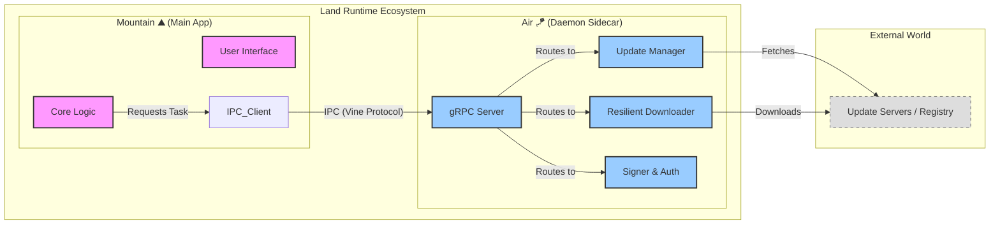

<table>
<tr>
<td align="left" valign="middle">
<h3 align="left"> Air</h3>
</td>
<td align="left" valign="middle">
<h3 align="left">
 🪁
</h3>
</td>
		<td align="left" valign="middle">
			<h3 align="left"> + </h3>
		</td>
		<td align="left" valign="middle">
			<h3 align="left">
				<a href="https://Editor.Land" target="_blank">
					<picture>
						<source media="(prefers-color-scheme: dark)" srcset="https://PlayForm.Cloud/Dark/Image/GitHub/Land.svg">
						<source media="(prefers-color-scheme: light)" srcset="https://PlayForm.Cloud/Image/GitHub/Land.svg">
						
					</picture>
				</a>
			</h3>
		</td>
		<td align="left" valign="middle">
			<h3 align="left">
				<a href="https://Editor.Land" target="_blank">
					Land
				</a>
			</h3>
		</td>
		<td align="left" valign="middle">
			<h3 align="left">
				🏞️
			</h3>
		</td>
	</tr>
</table>

---

# **Air**&#x2001;🪁

> **VS Code cold-starts slowly because everything initializes fresh each launch. Updates require a full restart that kills open terminals and in-progress work. There is no mechanism to pre-stage work between sessions.**

_"The next version is already downloaded and verified before you decide to update. No restart prompt ever."_

&#x2001;
&#x2001;

Air is a persistent background daemon that keeps running after you close the editor. It pre-downloads and PGP-verifies the next version between sessions, pre-indexes workspace changes while the editor is closed, and keeps language server warm caches available. When you launch Land, the expensive work is already done. Cold start under 200 ms. Updates apply between sessions with no interruption.

📖 **[Rust API Documentation](https://Rust.Documentation.Editor.Land/Air/)**

---

## What It Does&#x2001;🔐

- **Pre-staged updates.** The next version is downloaded, PGP-verified, and ready before you decide to update.
- **Pre-indexed workspaces.** File changes that happened while the editor was closed are already indexed.
- **Warm language server caches.** IntelliSense is ready before you finish the first keystroke.
- **No restart prompt.** Updates apply between sessions. You never see 'Restart to Update'.

---

## In the Ecosystem&#x2001;🪁 + 🏞️

---

## Development&#x2001;🛠️

Air is a component of the Land workspace. Follow the
[Land Repository](https://github.com/CodeEditorLand/Land) instructions to
build and run.

---

## License&#x2001;⚖️

CC0 1.0 Universal. Public domain. No restrictions.
[LICENSE](https://github.com/CodeEditorLand/Air/tree/Current/LICENSE)

---

## See Also

- [Air Documentation](https://editor.land/Doc/air)
- [Architecture Overview](https://editor.land/Doc/architecture)
- [Why Rust](https://editor.land/Doc/why-rust)
- [Mountain](https://github.com/CodeEditorLand/Mountain)
- [Echo](https://github.com/CodeEditorLand/Echo)

## Changelog 📜

Stay updated with our progress! See
[`CHANGELOG.md`](https://github.com/CodeEditorLand/Air/tree/Current/) for a
history of changes specific to **Air**.

---

## See Also

- [Architecture Overview](https://editor.land/Doc/architecture)
- [Mountain](https://github.com/CodeEditorLand/Mountain)
- [Vine](https://github.com/CodeEditorLand/Vine)
- [Mist](https://github.com/CodeEditorLand/Mist)

## Funding \& Acknowledgements 🙏🏻

**Air** is a core element of the **Land** ecosystem. This project is funded
through [NGI0 Commons Fund](https://NLnet.NL/commonsfund), a fund established by
[NLnet](https://NLnet.NL) with financial support from the European Commission's
[Next Generation Internet](https://ngi.eu) program. Learn more at the
[NLnet project page](https://NLnet.NL/project/Land).

The project is operated by PlayForm, based in Sofia, Bulgaria.

PlayForm acts as the open-source steward for Code Editor Land under the NGI0
Commons Fund grant.

<table>
	<thead>
		<tr>
			<th align="left"><strong>Land</strong></th>
			<th align="left"><strong>PlayForm</strong></th>
			<th align="left"><strong>NLnet</strong></th>
			<th align="left"><strong>NGI0 Commons Fund</strong></th>
		</tr>
	</thead>
	<tbody>
		<tr>
			<td align="left" valign="middle">
				
			</td>
			<td align="left" valign="middle">
				
			</td>
			<td align="left" valign="middle">
				
			</td>
			<td align="left" valign="middle">
				
			</td>
		</tr>
	</tbody>
</table>

---

**Project Maintainers**: Source Open
([Source/Open@Editor.Land](mailto:Source/Open@Editor.Land)) |
[GitHub Repository](https://github.com/CodeEditorLand/Air) |
[Report an Issue](https://github.com/CodeEditorLand/Air/issues) |
[Security Policy](https://github.com/CodeEditorLand/Air/security/policy)
