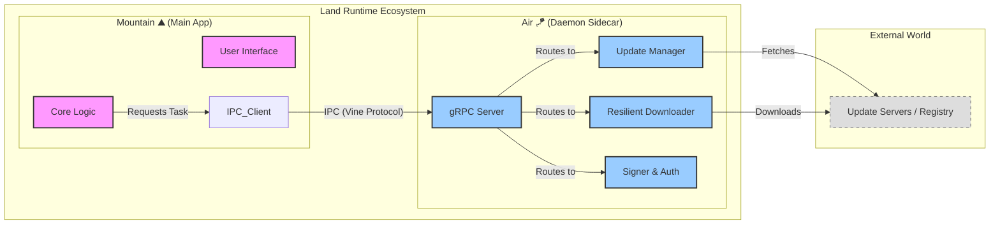

<table>
<tr>
<td align="left" valign="middle">
<h3 align="left"> Air</h3>
</td>
<td align="left" valign="middle">
<h3 align="left">
 🪁
</h3>
</td>
		<td align="left" valign="middle">
			<h3 align="left"> + </h3>
		</td>
		<td align="left" valign="middle">
			<h3 align="left">
				<a href="https://Editor.Land" target="_blank">
					<picture>
						<source media="(prefers-color-scheme: dark)" srcset="https://PlayForm.Cloud/Dark/Image/GitHub/Land.svg">
						<source media="(prefers-color-scheme: light)" srcset="https://PlayForm.Cloud/Image/GitHub/Land.svg">
						
					</picture>
				</a>
			</h3>
		</td>
		<td align="left" valign="middle">
			<h3 align="left">
				<a href="https://Editor.Land" target="_blank">
					Land
				</a>
			</h3>
		</td>
		<td align="left" valign="middle">
			<h3 align="left">
				🏞️
			</h3>
		</td>
	</tr>
</table>

---

# **Air** 🪁

The Native Background Daemon for Land 🏞️

[](https://github.com/CodeEditorLand/Air/tree/Current/LICENSE)
[](https://crates.io/crates/Air)
[](https://www.rust-lang.org/)

Air runs silently in the background so Land is always up to date and ready to
go. Close the editor, and Air keeps working: downloading updates, verifying
signatures, and indexing your workspace for instant search next time you open it.

Your editor never asks you to restart for updates. Air handles that.

📖 **[Rust API Documentation](https://Rust.Documentation.Editor.Land/Air/)**

---

## Key Features 🔐

- **Zero UI interruption.** Runs as a standalone sidecar process. Downloads,
  patches, and crypto operations never block the editor.
- **Silent updates.** Air downloads, verifies checksums, and stages updates
  while you work. The next launch is already on the latest version.
- **Secrets stay isolated.** Cryptographic signing and authentication happen
  in a separate process. The editor UI never touches private keys.
- **Resilient downloads.** Pause, resume, and auto-retry on network failure.
  Extensions and language servers download in the background.
- **Editor stays responsive.** Heavy I/O (indexing, large file fetches) runs
  experience.

---

## Deep Dive & Component Breakdown 🔬

To understand how `Air`'s internal components interact to provide the background
daemon functionality, see the following source files:

- **[`Source/`](https://github.com/CodeEditorLand/Air/tree/Current/Source/)** -
  Main daemon implementation
- **[`Source/Update/`](https://github.com/CodeEditorLand/Air/tree/Current/Source/Update/)** -
  Update lifecycle management
- **[`Source/Download/`](https://github.com/CodeEditorLand/Air/tree/Current/Source/Download/)** -
  Resilient download manager
- **[`Source/Auth/`](https://github.com/CodeEditorLand/Air/tree/Current/Source/Auth/)** -
  Authentication and cryptographic signing

The source files explain the gRPC server implementation, task delegation from
Mountain, and the progress event emission patterns.

---

## System Architecture Diagram 🏗️

This diagram illustrates how **Air** sits alongside `Mountain` to handle
background operations.



---

## `Air` in the Land Ecosystem 🪁 + 🏞️

| Component           | Role \& Key Responsibilities                                                         |
| :------------------ | :----------------------------------------------------------------------------------- |
| **Daemon Process**  | The persistent executable that runs independently of the main window.                |
| **Server Host**     | Hosts a local server to accept commands from `Mountain` or other authorized clients. |
| **Update Delegate** | The sole authority for modifying the installation files of the parent application.   |
| **Signer**          | Handles cryptographic signing of artifacts and secure token storage for user login.  |
| **Traffic Manager** | Acts as a proxy/downloader to keep network load off the main renderer process.       |

---

## Getting Started 🚀

### Installation 📥

To add `Air` to your project workspace:

```toml
[dependencies]
Air = { git = "https://github.com/CodeEditorLand/Air.git", branch = "Current" }
```

### Usage Pattern 🚀

**Air** is typically spawned automatically by `Mountain` during the startup
phase.

1. **Spawn:** `Mountain` detects if `Air` is running. If not, it spawns the
   binary.
2. **Connect:** `Mountain` establishes a Vine (gRPC) connection to `Air`'s local
   port `[::1]:50053` (reserved for Air, separate from Cocoon's port 50052).
3. **Delegate:** When a user requests an update or a large download, `Mountain`
   sends a command to `Air` and immediately returns control to the user.
4. **Monitor:** `Air` emits progress events back to `Mountain` to update the UI
   status bars.

### Port Allocation

- **Air**: Port `50053` (Vine/Air.proto protocol - Air daemon services)
- **Cocoon**: Port `50052` (Vine.proto protocol - VS Code extension hosting)

---

## License ⚖️

This project is released into the public domain under the **Creative Commons CC0
Universal** license.

You are free to use, modify, distribute, and build upon this work for any
purpose, without any restrictions. For the full legal text, see the
[`LICENSE`](https://github.com/CodeEditorLand/Air/tree/Current/) file.

---

## Changelog 📜

Stay updated with our progress! See
[`CHANGELOG.md`](https://github.com/CodeEditorLand/Air/tree/Current/) for a
history of changes specific to **Air**.

---


## See Also

- [Architecture Overview](https://editor.land/Doc/architecture)
- [Mountain](https://github.com/CodeEditorLand/Mountain)
- [Vine](https://github.com/CodeEditorLand/Vine)
- [Mist](https://github.com/CodeEditorLand/Mist)

## Funding \& Acknowledgements 🙏🏻

**Air** is a core element of the **Land** ecosystem. This project is funded
through [NGI0 Commons Fund](https://NLnet.NL/commonsfund), a fund established by
[NLnet](https://NLnet.NL) with financial support from the European Commission's
[Next Generation Internet](https://ngi.eu) program. Learn more at the
[NLnet project page](https://NLnet.NL/project/Land).

The project is operated by PlayForm, based in Sofia, Bulgaria.

PlayForm acts as the open-source steward for Code Editor Land under the NGI0
Commons Fund grant.

<table>
	<thead>
		<tr>
			<th align="left"><strong>Land</strong></th>
			<th align="left"><strong>PlayForm</strong></th>
			<th align="left"><strong>NLnet</strong></th>
			<th align="left"><strong>NGI0 Commons Fund</strong></th>
		</tr>
	</thead>
	<tbody>
		<tr>
			<td align="left" valign="middle">
				<a href="https://Editor.Land">
					
				</a>
			</td>
			<td align="left" valign="middle">
				<a href="https://PlayForm.Cloud">
					
				</a>
			</td>
			<td align="left" valign="middle">
				<a href="https://NLnet.NL">
					
				</a>
			</td>
			<td align="left" valign="middle">
				<a href="https://NLnet.NL/commonsfund">
					
				</a>
			</td>
		</tr>
	</tbody>
</table>

---

**Project Maintainers**: Source Open
([Source/Open@Editor.Land](mailto:Source/Open@Editor.Land)) |
[GitHub Repository](https://github.com/CodeEditorLand/Air) |
[Report an Issue](https://github.com/CodeEditorLand/Air/issues) |
[Security Policy](https://github.com/CodeEditorLand/Air/security/policy)
