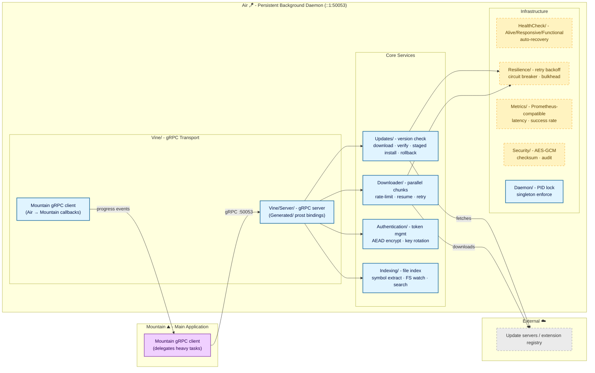

<table>
	<tr>
		<td align="left" valign="middle">
			<h3 align="left">
				Air&#x2001;🪁
			</h3>
		</td>
		<td align="left" valign="middle">
			<h3 align="left">
				+
			</h3>
		</td>
		<td align="left" valign="middle">
			<h3 align="left">
				<a href="https://editor.land" target="_blank">
					<picture>
						<source media="(prefers-color-scheme: dark)" srcset="https://editor.land/Dark/Image/GitHub/Land.svg" />
						<source media="(prefers-color-scheme: light)" srcset="https://editor.land/Image/GitHub/Land.svg" />
						
					</picture>
				</a>
			</h3>
		</td>
		<td align="left" valign="middle">
			<h3 align="left">
				<a href="https://editor.land" target="_blank">
					Land&#x2001;🏞️
				</a>
			</h3>
		</td>
	</tr>
</table>

---

# **Air**&#x2001;🪁

The Native Background Daemon for `Land`&#x2001;🏞️.

> **`VS Code` cold-starts slowly because everything initializes fresh each
> launch. Updates require a full restart that kills open terminals and
> in-progress work. There is no mechanism to pre-stage work between sessions.**

_"The next version is already downloaded and verified before you decide to
update. The main window never blocks waiting for a download."_

[](https://github.com/CodeEditorLand/Air/tree/Current/LICENSE)
[](https://www.rust-lang.org/)&#x2001;[](https://crates.io/crates/Air)
[](https://www.rust-lang.org/)&#x2001;[](https://www.rust-lang.org/)

**[Rust API Documentation](https://Rust.Documentation.editor.land/Air/)**&#x2001;📖

Welcome to **Air**, the lightweight, persistent daemon that powers the&#x2001;🪁
background capabilities of the **Land**&#x2001;🏞️ Code Editor. While `Mountain`
handles the core application logic and UI, **Air** operates as a specialized
sidecar process dedicated to heavy lifting, network operations, and system
maintenance. It ensures that the main editor remains responsive by offloading
resource-intensive tasks such as updates, large downloads, cryptographic
signing, and file indexing.

**Air** is engineered to:

1. **Serve as the Persistent Background Daemon:** Run as a standalone process
   alongside `Mountain`, surviving window closures and maintaining background
   services across sessions.
2. **Own the Update Lifecycle:** Take full ownership of downloading, verifying,
   and applying patches for `Land` without user interruption or restart prompts.
3. **Offload Heavy Network Operations:** Act as the traffic manager for large
   downloads (extensions, language servers, dependencies) with resilient
   resume-capable transfers.
4. **Isolate Security-Critical Operations:** Manage cryptographic signing,
   secure credential storage, and authentication token lifecycle, keeping
   sensitive logic isolated from the main application view.
5. **Maintain the File Index:** Build and persist a comprehensive file index
   with symbol extraction and fast fuzzy search across the entire workspace.

---

## Key Features&#x2001;🔐

- **Native Sidecar Architecture:** Runs as a standalone process alongside
  `Mountain`, communicating via high-performance IPC (`gRPC`/`Vine`) to handle
  requests without blocking the UI thread.
- **Dedicated Update Management:** Full ownership of the update lifecycle -
  downloading, verifying, and applying patches for `Land` - without user
  interruption or restart prompts.
- **File Indexing and Search:** Builds and maintains a comprehensive file index
  with symbol extraction, content analysis, and fast fuzzy search across the
  entire workspace.
- **Isolated Authentication & Signing:** Manages sensitive cryptographic
  operations, including binary signing and secure login flows, keeping security
  logic isolated from the main application view.
- **Background Downloader:** Implements a resilient download manager for
  extensions, language servers, and dependencies, capable of pausing, resuming,
  and handling network interruptions gracefully.
- **Health Monitoring:** Provides multi-level health checks with automatic
  recovery actions, performance tracking, and degradation alerts across all
  daemon services.
- **Resource Offloading:** The designated handler for any "heavy" task that
  doesn't require the main application loop - effectively decoupling
  infrastructure maintenance from the user experience.

---

## Core Architecture Principles&#x2001;🏗️

| Principle                      | Description                                                                                                                    | Key Components                                            |
| :----------------------------- | :----------------------------------------------------------------------------------------------------------------------------- | :-------------------------------------------------------- |
| **Sidecar Isolation**          | Run as a standalone daemon process, surviving independently of the main window lifecycle for persistent background operations. | `Daemon/`, `Binary/`, PID locking                         |
| **gRPC IPC Boundary**          | Use `Vine` (`tonic`-based `gRPC`) for all communication with `Mountain`, ensuring a high-performance and well-defined API.     | `Vine/`, `Air.proto`, generated prost bindings            |
| **Service Modularity**         | Each capability (updates, downloads, auth, indexing) lives in its own module with independent startup and health monitoring.   | `Updates/`, `Downloader/`, `Authentication/`, `Indexing/` |
| **Resilience by Default**      | Wrap all network operations in retry-with-backoff, circuit breakers, bulkheads, and timeouts via the shared `Resilience/` lib. | `Resilience/`, `HealthCheck/`                             |
| **Declarative Configuration**  | Load TOML config with schema validation, environment overrides, and hot reload without service interruption.                   | `Configuration/`, `Initialize/`                           |
| **Observable Operations**      | Emit structured JSON logs, distributed traces, and Prometheus metrics for every delegated task.                                | `Logging/`, `Tracing/`, `Metrics/`                        |
| **Secure Credential Handling** | Never expose raw secrets; store credentials with AEAD encryption (`ring`), enforce key rotation, and audit all access.         | `Security/`, `Authentication/`, `zeroize`                 |

---

## Deep Dive & Component Breakdown&#x2001;🔬

To understand how `Air`'s internal components interact to provide background
services, see
[`Documentation/GitHub/DeepDive.md`](https://github.com/CodeEditorLand/Air/tree/Current/Documentation/GitHub/DeepDive.md).
This document explains the startup sequence, the `Vine` `gRPC` routing layer,
and the data flow for update and download operations.

---

## System Architecture Diagram&#x2001;🏗️



---

## `Air` in the `Land`&#x2001;🏞️ Ecosystem&#x2001;🪁

| Component           | Role & Key Responsibilities                                                                     |
| :------------------ | :---------------------------------------------------------------------------------------------- |
| **Daemon Process**  | Persistent executable that runs independently of the main window, even after the window closes. |
| **Server Host**     | Hosts a local `gRPC` server on `[::1]:50053` to accept commands from `Mountain`.                |
| **Update Delegate** | Sole authority for modifying installation files of the parent application.                      |
| **Signer**          | Handles cryptographic signing of artifacts and secure token storage for user login.             |
| **Traffic Manager** | Proxy/downloader that keeps large network operations off the main renderer process.             |
| **File Indexer**    | Maintains a persistent file index with symbol extraction and fast search across the workspace.  |
| **Health Monitor**  | Periodically checks all service health with automatic recovery and degradation tracking.        |

### Port Allocation

| Process    | Port    | Protocol                    | Purpose                              |
| :--------- | :------ | :-------------------------- | :----------------------------------- |
| **Air**    | `50053` | `Vine`/`Air.proto` (`gRPC`) | Daemon services - updates, downloads |
| **Cocoon** | `50052` | `Vine.proto` (`gRPC`)       | `VS Code` extension hosting          |

---

## Project Structure&#x2001;🗺️

The `Air` source is organized into three layers: the binary entry point and
lifecycle, the `Vine` `gRPC` communication layer, and the service modules that
perform actual work.

```
Air/
└── Source/
    ├── Binary.rs                # Binary entry point for the Air daemon.
    ├── Library.rs               # Module declarations and crate-level exports.
    ├── Binary/                  # Daemon process lifecycle (startup, shutdown, monitoring).
    ├── Daemon/                  # Singleton enforcement, PID locking, platform-native integration.
    ├── Initialize/              # Configuration, port binding, gRPC server construction, per-service startup.
    ├── CLI/                     # Command-line interface for daemon interaction and diagnostics.
    ├── Vine/                    # gRPC protocol implementation (generated proto, server, errors).
    ├── ApplicationState/        # Central coordination (connections, service states, telemetry, resources).
    ├── Configuration/           # TOML config loading with schema validation, env overrides, hot reload.
    ├── DevLog.rs                # Developer-facing logging and trace ID generation.
    ├── Updates/                 # Version checking, download, verification, staged install, rollback.
    ├── Downloader/              # Parallel downloads, chunk transfers, rate limiting, resume capability.
    ├── Authentication/          # Token management, credential storage, AEAD encryption, key rotation.
    ├── Indexing/                # File index, symbol extraction, scanning, persistent storage, FS watch.
    ├── HealthCheck/             # Multi-level health monitoring (alive, responsive, functional).
    ├── Logging/                 # Structured JSON logging with trace ID propagation and rotation.
    ├── Metrics/                 # Prometheus-compatible metrics (latency, success rate, resource usage).
    ├── Resilience/              # Retry with backoff, circuit breaker, bulkhead, timeout management.
    ├── Security/                # Checksum verification, AES-GCM credential storage, audit subsystem.
    ├── Tracing/                 # Distributed tracing with sampling, span events, context propagation.
    └── HTTP/                    # Secure HTTP client with custom DNS, TLS, timeout management.
```

---

## Getting Started&#x2001;🚀

### Prerequisites

- Rust 1.75 or later
- Protocol Buffer compiler (included via `tonic-build` build dependency)

### Build

```bash
cd Element/Air
cargo build --release
```

### Run

```bash
# Run with default settings
./Target/release/Air

# Or via cargo
cargo run --bin Air
```

### Key Dependencies

| Crate / Package          | Purpose                                                      |
| :----------------------- | :----------------------------------------------------------- |
| `tonic` / `prost`        | `gRPC` server and Protocol Buffer code generation            |
| `Vine`                   | Local path dependency - generated `Air.proto` gRPC contracts |
| `Common`                 | Local path dependency - shared types and abstractions        |
| `Mist`                   | Local path dependency - DNS isolation for HTTP client        |
| `reqwest` / `rustls`     | HTTPS downloads with TLS certificate verification            |
| `tokio`                  | Async runtime for concurrent I/O and task scheduling         |
| `notify` / `ignore`      | File system event watching for real-time index updates       |
| `ring` / `zeroize`       | Cryptographic signing and secure credential storage          |
| `tracing`                | Structured JSON logging with span propagation                |
| `config` / `toml`        | Configuration file loading with hot-reload support           |
| `sysinfo` / `systemstat` | System resource monitoring and health checks                 |
| `walkdir` / `ignore`     | Recursive directory traversal for file indexing              |

### Usage Pattern&#x2001;🚀

**Air** is typically spawned automatically by `Mountain` during startup.

1. **Spawn:** `Mountain` detects if `Air` is running. If not, it spawns the
   binary.
2. **Connect:** `Mountain` establishes a `Vine` (`gRPC`) connection to `Air`'s
   local port `[::1]:50053`.
3. **Delegate:** When a user requests an update or large download, `Mountain`
   sends a command to `Air` and immediately returns control to the user.
4. **Monitor:** `Air` emits progress events back to `Mountain` to update the UI
   status bars.

---

## See Also&#x2001;🔗

- [`Mountain`](https://github.com/CodeEditorLand/Mountain)
- [`Vine`](https://github.com/CodeEditorLand/Vine)
- [`Mist`](https://github.com/CodeEditorLand/Mist)
- [`Common`](https://github.com/CodeEditorLand/Common)
- [`Echo`](https://github.com/CodeEditorLand/Echo)

---

## License&#x2001;⚖️

This project is released into the public domain under the **Creative Commons CC0
Universal** license. You are free to use, modify, distribute, and build upon
this work for any purpose, without any restrictions. For the full legal text,
see the [`LICENSE`](https://github.com/CodeEditorLand/Air/tree/Current/LICENSE) file.

---

## Changelog&#x2001;📜

See [`CHANGELOG.md`](https://github.com/CodeEditorLand/Air/tree/Current/CHANGELOG.md) for a
history of changes specific to **Air**&#x2001;🪁.

---

## Funding & Acknowledgements&#x2001;🙏🏻

**Air** is a core element of the **Land**&#x2001;🏞️ ecosystem.&#x2001;🪁 through
[NGI0 Commons Fund](https://NLnet.NL/commonsfund), a fund established by
[NLnet](https://NLnet.NL) with financial support from the European Commission's
[Next Generation Internet](https://ngi.eu) program. Learn more at the
[NLnet project page](https://NLnet.NL/project/Land).

The project is operated by PlayForm, based in Sofia, Bulgaria.

PlayForm acts as the open-source steward for Code Editor Land under the NGI0
Commons Fund grant.

<table>
	<thead>
		<tr>
			<th align="left">
				<strong>
					Land
				</strong>
			</th>
			<th align="left">
				<strong>
					PlayForm
				</strong>
			</th>
			<th align="left">
				<strong>
					NLnet
				</strong>
			</th>
			<th align="left">
				<strong>
					NGI0 Commons Fund
				</strong>
			</th>
		</tr>
	</thead>
	<tbody>
		<tr>
			<td align="left" valign="middle">
				<a href="https://editor.land">
					
				</a>
			</td>
			<td align="left" valign="middle">
				<a href="https://PlayForm.Cloud">
					
				</a>
			</td>
			<td align="left" valign="middle">
				<a href="https://NLnet.NL">
					
				</a>
			</td>
			<td align="left" valign="middle">
				<a href="https://NLnet.NL/commonsfund">
					
				</a>
			</td>
		</tr>
	</tbody>
</table>

---

**Project Maintainers**: Source Open (Source/Open@editor.land) |
[GitHub Repository](https://github.com/CodeEditorLand/Air) |
[Report an Issue](https://github.com/CodeEditorLand/Air/issues) |
[Security Policy](https://github.com/CodeEditorLand/Air/security/policy)
